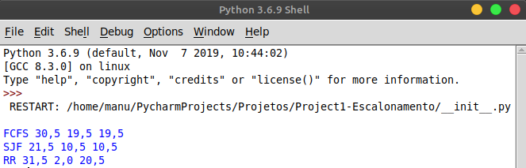

## Projeto 01 - Algoritmos de Escalonamento

Neste projeto você deve implementar um conjunto de algoritmos de escalonamento de CPU e escrever
um programa que calcula uma série de estatísticas baseado nestes algoritmos.

Os algoritmos de escalonamento a serem implementados são os seguintes:
- [x] FCFS: First-Come, First-Served
- [x] SJF: Shortest Job First
- [x] RR: Round Robin (com quantum = 2)

O seu programa deverá ler de um arquivo uma lista de processos com seus respectivos tempos de
chegada e de duração e deverá imprimir na tela uma tabela contendo os valores para as seguintes
métricas:
- [x] Tempo de retorno médio
- [x] Tempo de resposta médio
- [x] Tempo de espera médio

### Saída:

