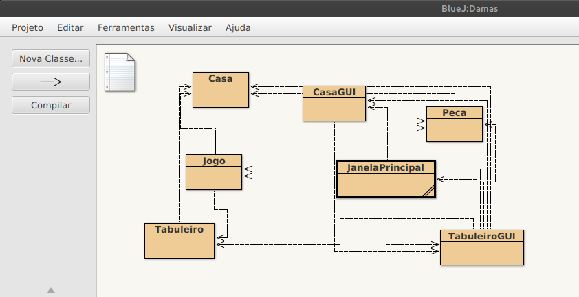
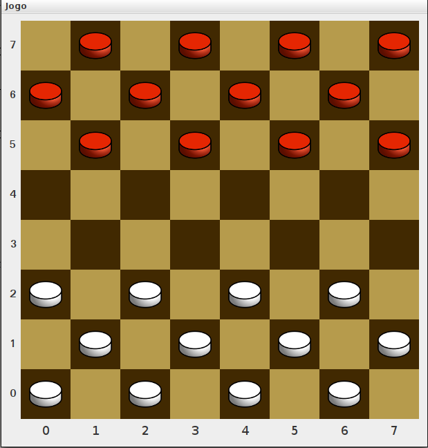
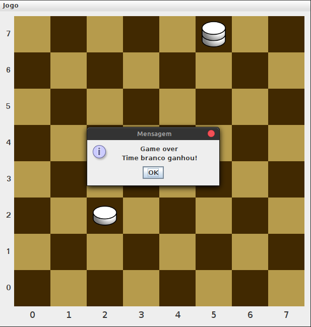

<table align="center"><tr><td align="center" width="9999">

### Projetos implementados durante estudos da disciplina de Linguagem de Programação I.

 

[Screens](#Screens) |
[Damas](https://github.com/EmmanuellaAlbuquerque/college-stuff/tree/master/Programming-Language-1/Damas)

</td></tr></table>

Projeto da disciplina Linguagem de Programação I - 2018.1

O projeto foi desenvolvido utilizando bluej, ambiente de desenvolvimento integrado para desenvolvimento Java.

HOW TO START THIS PROJECT: 
- [x] Clique com o botão direito em JanelaPrincipal e em new JanelaPricipal()

## Screens

* ### BlueJ Class Diagram

* ### Game

* ### Game Over

