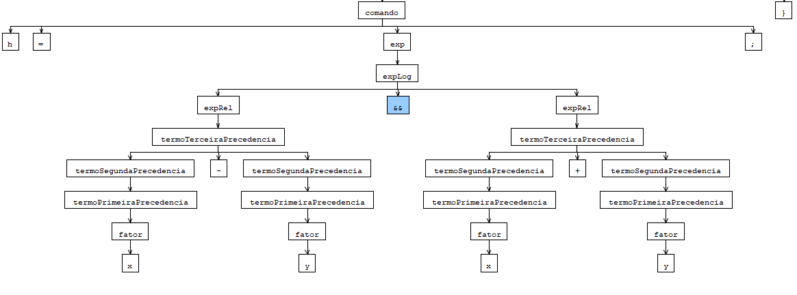

### Gramáticas Livres de Contexto

### Objetivo

Trabalhar com uma GLC para linguagem de programação simples, usando uma ferramenta robusta para criação de analisadores sintáticos, o ANTLR Works.

 

Neste projeto, utilizamos o arquivo inicial da gramática: cmm.g disponibilizado pelo professor.

Exemplo executado: h = x-y && x+y;

